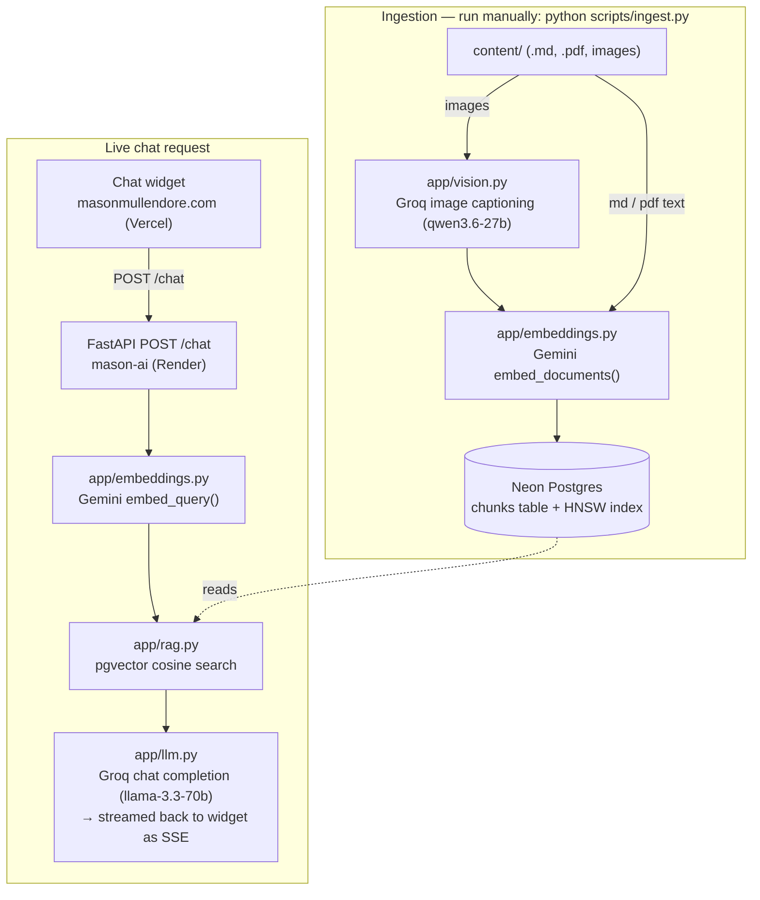

# mason-ai

A small FastAPI backend that answers visitor questions about Mason Mullendore, using
retrieval-augmented generation (RAG) over a bio/resume corpus. Deployed on Render;
consumed by a chat widget on [masonmullendore.com](https://masonmullendore.com) (hosted
separately on Vercel). Image captioning and answer generation run on **Groq**'s free
tier (30 RPM / 1,000 RPD); embeddings stay on **Google Gemini** (Groq doesn't offer an
embeddings API). Retrieval runs on **Neon Postgres + pgvector** with an HNSW index, so
the store scales past what fits comfortably in process memory.

## Architecture



Two independent flows share the same Postgres table: **ingestion** (offline, run by hand
whenever `content/` changes) writes chunks + embeddings into Neon; **runtime** (every
chat request) reads from it. The FastAPI app never touches `content/` directly — it only
ever talks to Neon, Groq, and Gemini.

## How it works

- `content/` holds the source material — drop in any number of `.md`, `.pdf`, and/or
  image (`.jpg`/`.jpeg`/`.png`/`.webp`/`.gif`) files.
- `scripts/ingest.py` reads every file: `.md`/`.pdf` get chunked as text (PDF text is
  extracted via `pypdf`); images get normalized to real JPEGs and captioned by Groq
  into a factual text description, which is then treated as a normal chunk. Everything
  is embedded with Gemini (`gemini-embedding-2`), then loaded into a `chunks` table in
  Postgres (`source`, `text`, `embedding vector(768)`) — the table is truncated and
  reloaded fresh on every ingestion run, and an HNSW index (`vector_cosine_ops`) is
  rebuilt afterward. Re-run `ingest.py` whenever `content/` changes.
- At request time, `app/main.py`'s `POST /chat` embeds the incoming question (Gemini),
  retrieves the top-k similar chunks via a single indexed pgvector query (`app/rag.py` —
  `ORDER BY embedding <=> %s LIMIT %s`, using the HNSW index rather than scanning every
  row), and streams back a Groq-generated answer (`llama-3.3-70b-versatile`) grounded in
  those chunks as Server-Sent Events.
- `app/db.py` holds a small connection pool (`psycopg_pool`) shared by ingestion and
  retrieval; `scripts/init_db.py` is the idempotent schema setup (`CREATE EXTENSION
  vector`, `CREATE TABLE chunks`), safe to run against a brand-new database.

**Note on PDFs**: text extraction from PDFs can be a little messy (odd spacing from
ligatures/multi-column layouts) — worth a quick look at what `ingest.py` actually pulled
out of a PDF before trusting it fully. It's fine for a straightforward single-column
resume.

**Note on images**: images are captioned once at ingestion time (turned into a text
description, which is what actually gets embedded/retrieved) rather than embedded as
images directly — this keeps everything in one text-based retrieval pool instead of
mixing image and text vector spaces. The console output from `ingest.py` prints each
caption it generates, so you can check it's actually describing the image accurately
before trusting it.

**Why Postgres/pgvector instead of a flat file**: with a handful of bio paragraphs, an
in-memory brute-force search would genuinely be fine — this is a deliberate choice to
use a real, indexed, scalable retrieval store (the same pattern used for production-size
RAG) rather than the size of today's content actually requiring it.

## Setting up Neon (Postgres + pgvector)

1. Go to [neon.tech](https://neon.tech) and sign up (GitHub/Google/email) — the free tier
   requires no credit card.
2. Click **Create a project**. Give it a name (e.g. `mason-ai`), pick a region close to
   where Render will run your app (e.g. a US region if deploying Render's Oregon default),
   and leave the Postgres version at its default. Click **Create project**.
3. Once created, Neon lands you on the project dashboard with a **Connect** panel already
   open. Under **Connection string**, make sure the **Database** is `neondb` (or whatever
   you named it) and the **Role** is the default owner role.
4. **Use the direct connection string, not the pooled one** (the pooled one has
   `-pooler` in the hostname) — copy the one *without* `-pooler`. This matters here
   specifically: `psycopg` auto-promotes repeated statements to server-side prepared
   statements, which don't survive Neon's PgBouncer transaction-pooling mode and can
   break `ingest.py`'s bulk inserts. Our own `app/db.py` already keeps a small
   connection pool (`psycopg_pool`, 1–5 connections) on the app side, so Neon's own
   pooler isn't needed at this traffic scale anyway.
5. Paste that connection string into `.env` as `DATABASE_URL`. Nothing else to configure
   manually — enabling the `vector` extension and creating the `chunks` table both happen
   automatically the first time you run `scripts/init_db.py` or `scripts/ingest.py`.

## Local development

```bash
python3 -m venv venv
source venv/bin/activate
pip install -r requirements.txt
cp .env.example .env   # fill in GEMINI_API_KEY, GROQ_API_KEY, and DATABASE_URL

python scripts/ingest.py       # embeds content/ and loads it into Postgres
uvicorn app.main:app --reload  # serves on http://localhost:8000
```

Test it:

```bash
curl -N -X POST localhost:8000/chat \
  -H "Content-Type: application/json" \
  -d '{"message": "What does Mason do?"}'
```

## Updating content

1. Edit or add `.md`/`.pdf`/image files under `content/` — any number of documents,
   mixed formats are fine.
2. Re-run `python scripts/ingest.py` — this truncates and reloads the `chunks` table and
   rebuilds the HNSW index, so it's safe to re-run any time content changes.
3. Redeploy the FastAPI app if needed (Render redeploys automatically on push, if
   connected to the repo) — note the *app* doesn't need redeploying just because content
   changed, only if code changed, since `ingest.py` writes straight to Neon.

## Deploying to Render

1. Push this repo to GitHub.
2. In Render, "New +" → "Blueprint", point it at the repo — it will pick up
   `render.yaml` automatically.
3. Fill in the four environment variables in the Render dashboard (they're marked
   `sync: false` in `render.yaml`, so Render prompts for them rather than expecting them
   committed): `GEMINI_API_KEY`, `GROQ_API_KEY`, `DATABASE_URL` (the Neon **direct**,
   non-pooled connection string — see the Neon setup section above for why),
   `ALLOWED_ORIGIN` (set this to `https://masonmullendore.com`).
4. Once deployed, confirm `https://<your-service>.onrender.com/health` returns
   `{"status": "ok"}`.

**Free-tier notes**:
- Render's free web services spin down after inactivity and cold-start on the next
  request (10–30s delay). The first question after idle time will feel slow — will need 
  upgrade to a paid instance later if speed causes poor UX.
- Groq's free tier (30 RPM / 1,000 RPD) handles the traffic-heavy calls (captioning +
  chat generation) — plenty of headroom for a personal site. Gemini handles embeddings
  on a separate quota. If you ever do hit a limit on either, check
  [ai.dev/rate-limit](https://ai.dev/rate-limit) (Gemini) or
  [console.groq.com](https://console.groq.com) (Groq) for current usage.
- Neon's free tier scales compute to zero when idle and wakes on the next query —
  another source of first-request latency alongside Render's own cold start, both fine
  for personal-site traffic levels.

## Wiring up the frontend widget

This repo doesn't touch the masonmullendore.com frontend — it only exposes the API. A
minimal React component consuming it (reading the SSE stream via `fetch` + a body
reader, since `EventSource` doesn't support POST bodies):

```tsx
import { useState } from "react";

const API_URL = "https://<your-service>.onrender.com/chat";

export function ChatWidget() {
  const [answer, setAnswer] = useState("");

  async function ask(message: string) {
    setAnswer("");
    const response = await fetch(API_URL, {
      method: "POST",
      headers: { "Content-Type": "application/json" },
      body: JSON.stringify({ message }),
    });
    const reader = response.body!.getReader();
    const decoder = new TextDecoder();
    let buffer = "";

    while (true) {
      const { done, value } = await reader.read();
      if (done) break;
      buffer += decoder.decode(value, { stream: true });

      const lines = buffer.split("\n\n");
      buffer = lines.pop() ?? "";
      for (const line of lines) {
        if (!line.startsWith("data: ")) continue;
        const payload = line.slice(6);
        if (payload === "[DONE]") continue;
        const { delta } = JSON.parse(payload);
        setAnswer((prev) => prev + delta);
      }
    }
  }

  return (
    <div>
      <button onClick={() => ask("What does Mason do?")}>Ask a question</button>
      <p>{answer}</p>
    </div>
  );
}
```

Drop this into the actual site repo and swap the hardcoded question for a real input
field once you're ready to wire it up.
